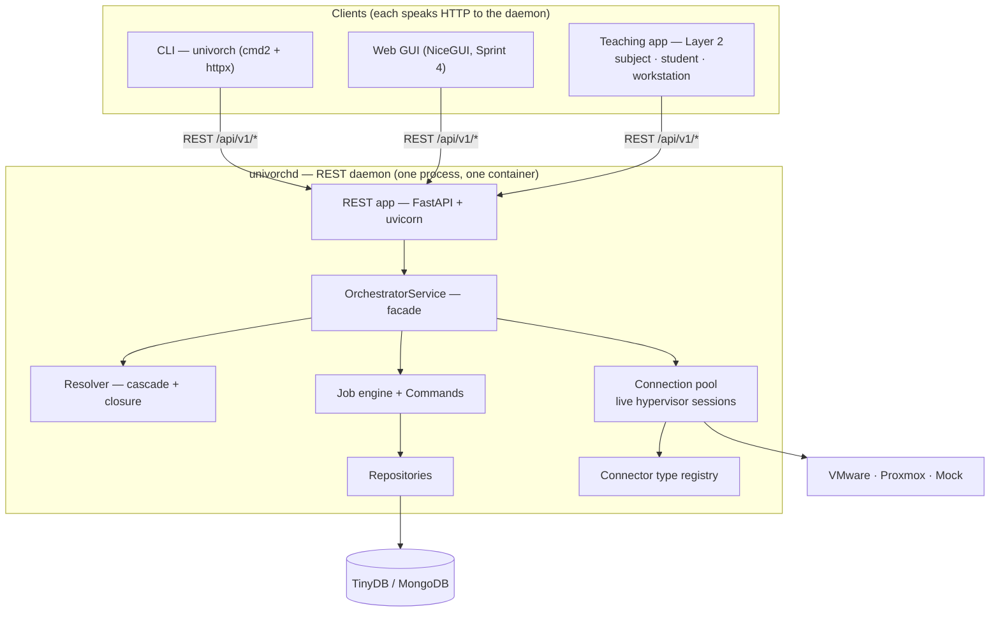
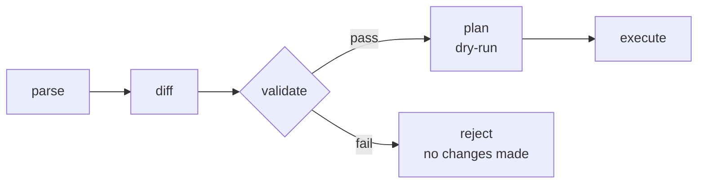
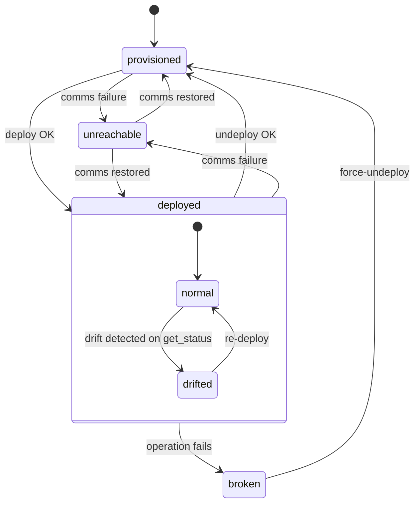

# UnivOrch — Architecture Document

> Phase 3 deliverable — Design of the Universal Virtual Machine Orchestrator  
> TFG — Universidad de Málaga  
> **Last refresh:** 2026-06-07 — incorporates Sprint 2 Piece 3 (connector
> type registry + live-session pool, template lexical closure) and Sprint 3
> (REST daemon, dual-binary client/server model, downloadable container,
> one-line installer).

---

## 1. Overview

UnivOrch is a Linux service written in Python that provides a unified abstraction layer for managing virtual machines across different hypervisors. This document describes the internal architecture of the system: how it is structured, how its components communicate, and the reasoning behind the key design decisions.

The requirements that this architecture satisfies are defined in `docs/requirements.md`. The consolidated vocabulary used throughout this document (folder, descriptor, base VM, template, definition, state, …) is in [docs/glossary.md](glossary.md). Traceability to specific design decisions is provided via DEC-xxx references throughout the document.

---

## 2. Two-Layer Architecture

The system is divided into two independent layers (DEC-004):

**Layer 1 — Generic orchestrator core:** manages the descriptor tree, the job engine, hypervisor connectors, persistence, and the service API. It has no knowledge of any particular use case.

**Layer 2 — Teaching application:** a client of the core that interprets the tree using domain-specific semantics (subjects, students, workstations). It translates teaching concepts into generic core operations.

This separation ensures the core is reusable for other use cases (CTF competitions, research labs, corporate training) without modification. Each such application is a distinct layer-2 client built on the same core.



---

## 3. Code Structure and Extensibility

The system is packaged as a single Python package (`univorch`) with two explicit extension points (DEC-A1):

- **Hypervisor connectors:** registered by name in an internal connector registry. The registry abstraction is designed so that future third-party connectors can be distributed as separate pip-installable packages and registered via Python entry points (`univorch.connectors`) without modifying the core.
- **Layer-2 applications:** the teaching application is a separate module that imports and calls the core service API. Additional applications follow the same pattern.

In v1 all code lives in a single repository, and connectors are registered via a simple internal dictionary. The entry-point mechanism is the seam for future extensibility.

---

## 4. The Descriptor Tree

### 4.1 Data model

The tree consists of two node types:

- **Folder:** a container node with a path, a set of imported definitions, and a local definition block. Folders may be nested to any depth.
- **Descriptor:** a leaf node that defines a VM — its desired configuration, the hypervisor it targets, and its current state.

### 4.2 Materialized path (DEC-B1)

Every node stores its full path as a string key (e.g., `/root/informatics/os-lab/student01`). This design, borrowed from filesystem paths, provides two properties for free:

- **Ancestor lookup:** the set of all ancestors of a node is extracted from the path string itself without additional queries.
- **Subtree queries:** all descendants of a folder are found by a prefix filter on the path key.

No adjacency list or closure table is needed. Queries that span the tree (e.g., "all descriptors under this subject") are a single prefix scan on the path field.

### 4.3 Cascade inheritance (DEC-010, DEC-012, DEC-026)

Each folder declares which definitions it imports from its parent. The wildcard `*` imports everything available. What is not imported is not visible below.

The combination rule when a child overrides an inherited value depends on the data type (DEC-026):

| Type | Rule |
|---|---|
| Scalar (`key: value`) | Child replaces parent |
| List (`key: [a, b]`) | Child entries are appended to parent entries |
| Map (`key: {f: v}`) | Recursive merge, same rules applied to sub-fields |

A field may declare an exception to its default rule. The known v1 case is `ip_pool`, which replaces the entire block rather than merging, because its sub-fields (range, mask, gateway) only make sense as a coherent unit.

Permissions (`managers`, `end_users`) are two lists that accumulate downward. A user assigned as manager at a given folder retains that role in all descendants unless explicitly overridden at a lower level. Revocation is performed at the node where the assignment was made; lists do not support removal entries in v1.

### 4.3.1 Lexical closure of templates (DEC-012 refinement, 2026-06-06)

A template carries the lexical environment of the folder where it is **defined**, not of the folder where it is **used**. When a descriptor references a template through `use template: T`, every internal reference inside `T` (for instance `use hypervisor: mock01`) is resolved by walking the tree from `T`'s defining folder, not from the descriptor's own folder.

This is the closure rule of functional languages applied to inheritable resources. In practice, it means a teaching folder can `import: [linux-vm]` without having to also import `mock01` — the template knows its own hypervisor because that hypervisor lives next to it.

The implementation is captured by a generic walker, `_find_resource(name, start, folders_repo, attribute)`, that traverses ancestors honouring `import:` filters. The two concrete walkers (`_find_template`, `_find_hypervisor`) are one-line adapters over it. When future resource types (datastores, IP pools) join the model, they reuse the same walker.

### 4.4 Lazy resolution (DEC-B2)

The effective definition of any node is computed on demand, never stored. The `Resolver` implements a pure function:

```
resolve(node_path) → (ancestors, imports) → effective_definition
```

The same `Resolver` handles both property definitions and permission resolution, since both problems follow the same inheritance rules.

The `Resolver` supports two output modes:

- **Normal mode:** returns effective values only. Used by the job engine and all internal logic.
- **Annotated mode:** returns each value paired with the path of the node that provided it. Used by the web editor to display inherited properties in a distinct colour with their origin.

---

## 5. The Declarative Model

### 5.1 The load/plan flow (DEC-027)

> **Naming note (2026-05-26).** The single ingestion operation is implemented as
> `load(document, destination)` taking a `DefinitionDocument`. The historical
> decision label keeps the name *apply/plan flow* because the diary is not
> rewritten; the rest of this document uses the current names. See the
> [glossary](glossary.md) for the full vocabulary.

All state changes enter the system through a single operation: `load(document, destination)`. The document is a relative YAML structure (folders and VMs to place, no absolute paths) that is loaded into a destination folder. The destination must exist; the load itself never modifies the destination's own properties — it only places children inside.

The execution flow is:



1. **Parse:** the document is parsed and its structure validated for syntax correctness.
2. **Diff:** the parsed document is compared against the current tree state to determine what would change.
3. **Validate (fail fast):** before any modification, the system checks:
   - RBAC: does the user have permission to perform each change?
   - Resources: are there free IP addresses? Is the target hypervisor reachable?
   - Consistency: does this change affect deployed VMs? Are any descriptors locked?
   - Locks: if batch, are all required locks available?
   If any check fails, the operation is rejected with a detailed error. Nothing is modified.
4. **Plan:** the validated change set is presented to the user as a dry-run. This is the same flow with step 5 omitted; the `validate()` method of each Command is called without calling `execute()`.
5. **Execute:** the Commands are executed in order.

**Atomicity in v1:** best-effort with report. There is no global rollback. What succeeds is committed; what fails leaves the affected descriptor in `broken` or `provisioned` state, visible in the job history. This is consistent with the approach of tools such as Ansible and Terraform.

### 5.2 Two categories of operation

| Category | Examples | Execution path |
|---|---|---|
| Machine operations | deploy, undeploy, start, stop | Connector → hypervisor; slow; acquire lock |
| Definition operations | create/edit folder, edit descriptor | Write to repositories; fast; brief lock |

Both categories use the same architecture and the same load/plan flow. The validation content differs: machine operations check hypervisor reachability and IP availability; definition operations check tree consistency and permission scope.

### 5.3 Editing interfaces

Three equivalent paths for modifying a definition, all using the same load engine:

1. **CLI `set`:** targeted update of a single field (`univorch set <path> <key>=<value>`). Future Sprint, post Resolver.
2. **Web YAML editor:** split panel — editable YAML on the left, live-parsed tree on the right. Inherited properties shown in a distinct colour with their origin path. A "Check" button runs the plan (dry-run) before the user commits.
3. **YAML upload/download:** full document upload processed by `load`; download (`save`, future) returns the locally written definition (not the resolved effective definition).

### 5.4 Export and round-trip fidelity

Only the **locally written definition** of a node is exported and re-importable with full fidelity. It contains exactly what the user has specified for that node, without inherited values.

The **effective resolved definition** is available as a read-only view in real time. It is not exportable for re-import, because its value depends on the position in the tree; importing it elsewhere would produce different results after inheritance.

Two export modes are supported:

- **Absolute:** the exported YAML includes the full node path. Re-importing places the content at that exact path.
- **Portable/relative:** the exported YAML omits the path. Re-importing requires the user to specify a target folder. This produces reusable templates (equivalent to roles in Ansible or modules in Terraform).

### 5.5 Comment preservation

YAML comments are preserved using `ruamel.yaml` in round-trip mode (DEC-027, Option C). The parsed structure is the operational source of truth used by the Resolver and the job engine. The original YAML text, including comments and formatting, is stored alongside the parsed structure as a secondary blob. When a CLI `set` updates a field, `ruamel.yaml` modifies only that field in the blob, leaving comments intact.

---

## 6. The Job Engine

### 6.1 Command pattern (DEC-028)

Every operation is encapsulated as a Command object with two methods:

- `validate()`: checks that the operation is permissible and feasible. Called during the plan phase without side effects.
- `execute()`: performs the operation. Called only after full validation.

The job engine treats all Commands uniformly, regardless of whether they represent machine operations or definition changes. This makes the engine extensible: new operation types are added by implementing a new Command class, not by modifying the engine.

### 6.2 Job lifecycle

Every operation creates a Job record in the database before execution (DEC-015):

```
pending → running → completed
                 → failed
                 → interrupted  (detected at startup after a crash)
```

In v1, execution is synchronous: the caller waits for the job to complete. The interface is already Job-oriented, however, so replacing the synchronous executor with an asynchronous queue in the future requires no changes to the facade or the clients.

Batch operations (e.g., deploy an entire folder) create a parent Job and one child Job per target. The parent Job holds the aggregate status.

### 6.3 Locking

Each descriptor record in the database has a `locked_by` field that holds the ID of the Job currently acting on it (or null if free). The lock is acquired before execution and released on completion, whether successful or not. Because the lock lives in the database, it survives process restarts and is compatible with future active/passive HA (DEC-028).

**Batch lock policy:** the parent Job acquires all required locks atomically during the validation phase. If any descriptor is already locked, the entire batch is rejected before any modification. If all locks are available, they are acquired together before the first child Job begins.

### 6.4 Interrupted Jobs

If the service crashes with Jobs in the `running` state, the restart procedure detects them in the database and marks them `interrupted`. The administrator is notified. No automatic recovery is attempted in v1; the administrator decides whether to re-run or clean up. Automatic recovery is a future HA feature.

---

## 7. Hypervisor Connectors

### 7.1 Abstract interface (DEC-029)

All connectors implement the `HypervisorConnector` abstract base class (Python `ABC`):

| Method | Description |
|---|---|
| `clone(base_vm, target, mode="linked")` | Create a VM from a base image. `mode="full"` is in the contract but unsupported in v1 (raises `NotSupported`) |
| `delete(vm)` | Remove the VM and its virtual disk |
| `start(vm)` | Power on |
| `stop(vm)` | Graceful shutdown |
| `force_stop(vm)` | Hard power off |
| `pause(vm)` / `resume(vm)` | Suspend / resume |
| `get_status(vm)` | Runtime state from the hypervisor (running / stopped / paused) |
| `get_info(vm)` | Current configuration as reported by the hypervisor |

`deploy` and `undeploy` are orchestrator-level concepts, not connector primitives. `deploy` maps to `clone`; `undeploy` maps to `delete` followed by setting the descriptor state to `provisioned`.

ABC is chosen over `typing.Protocol` for three reasons: it fails loudly at instantiation if a method is missing (rather than at call time); it self-documents the relationship through explicit inheritance; and it allows shared default implementations for common logic.

### 7.2 Type registry and live-session pool (DEC-036)

After Sprint 2 Piece 3 the service no longer receives ready-made connector **instances**; it receives the **type registry** and instantiates a live session the first time each hypervisor is used. Two separate structures with two different responsibilities:

- **`CONNECTOR_TYPES`** — a hardcoded dictionary in `univorch/connectors/__init__.py` mapping type names to connector classes:

  ```python
  CONNECTOR_TYPES: dict[str, type[HypervisorConnector]] = {
      "mock": MockConnector,
      # "vmware":  VMwareConnector,    # when the connector lands
      # "proxmox": ProxmoxConnector,
  }
  ```

  Adding a new connector type is one import plus one entry. Python entry-point auto-discovery is left as a future extension for third-party connectors (DEC-029), not a v1 requirement.

- **`_connection_pool`** — a dictionary attribute of `OrchestratorService` mapping the **path of the folder that declared a hypervisor** to the live connector session. Two hypervisors with the same name in different branches (for instance two folders each declaring `aulario`) keep distinct live sessions, so their credentials, sockets and in-memory state never collide.

The pool is **not a Repository**: the live objects hold OS resources (TLS sockets, vSphere tokens, in-memory mock state) that are neither serialisable nor safe to persist (credentials must not land in TinyDB — DEC-021). When the service restarts the pool is empty; sessions are re-created on demand from the declarations stored in the folder tree.

The resolution flow when `use hypervisor: X` is encountered:

1. `_find_hypervisor` walks the tree from the descriptor's folder (or from the template's defining folder, for closure cases) and finds the `HypervisorDef`.
2. The `type:` value of that `HypervisorDef` is validated against `CONNECTOR_TYPES`.
3. If the pool already has a session indexed by the defining folder path, it is reused; otherwise the connector class is instantiated and stored in the pool.
4. The live session is handed to the Command that needs it.

The whole pipeline lives behind `OrchestratorService._resolve_hypervisor`. The Commands never know about the registry, the pool, or the walker; they receive a fully resolved live connector object.

### 7.3 Mock connector

The mock connector implements the full `HypervisorConnector` ABC and is registered alongside the real connectors. It is configurable at runtime for:

- Simulated operation failures (by operation type and probability)
- Simulated network latency
- Simulated configuration drift (causing `get_info` to return values that differ from the descriptor)

This enables full TDD of the job engine, state machine transitions, and error-handling logic without a physical hypervisor.

### 7.4 Comparison with existing libraries

The VMware and Proxmox connectors are implemented from scratch without depending on `esxobjects` or `yamlinfr` (the supervisor's existing libraries). Once implemented, the connectors will be compared with those libraries and the design differences documented as an evaluative analysis in the TFG thesis. This comparison is an intentional deliverable, not a workaround.

---

## 8. Persistence Layer

### 8.1 Document model (DEC-030)

The descriptor's definition field has free-form structure that varies across use cases. A document-oriented database (JSON-like documents with no fixed schema) is a natural fit, whereas a relational table with fixed columns would require awkward workarounds for variable-structure data.

### 8.2 TinyDB (v1) and MongoDB (future)

**v1 — TinyDB:** a pure-Python document database stored as a single JSON file. No server, no network, no configuration. Backup is a file copy (DEC-024). Appropriate for a proof of concept.

**Future — MongoDB:** the same document philosophy with production-grade features: server process, replication, multi-document transactions, indexes, and active/passive HA. Migration from TinyDB to MongoDB requires only replacing the Repository implementations; no other code changes.

### 8.3 Repositories

One Repository per aggregate, each exposing a uniform interface (`save`, `get_by_id`, `find_by_path`, `update`, `delete`) that hides the database engine completely (DEC-007):

| Repository | Contents |
|---|---|
| `FolderRepository` | Folder nodes: path, local definition, imports |
| `DescriptorRepository` | Descriptors: state, lock field, YAML blob, assigned IP |
| `JobRepository` | Jobs and child jobs: state, timestamps, output, errors |
| `IPPoolRepository` | Pool definitions and IP allocation records |
| `SessionRepository` | Active sessions: token, user, expiry |
| `UserRepository` | Users: stored in a separate YAML file (v1); abstracted for future LDAP/AD migration |

### 8.4 Consistency limitation in v1

TinyDB does not support multi-document transactions. An operation that writes to multiple repositories (e.g., deploy touches `DescriptorRepository`, `JobRepository`, and `IPPoolRepository`) may leave them in an inconsistent state if the process crashes mid-operation. This is not emulated in v1. Instead:

- The write order is designed to minimise the impact of a partial failure.
- A startup validation routine detects common inconsistencies.
- The best-effort atomicity model (section 5.1) is the consistent response to this limitation.

MongoDB (future) provides real multi-document transactions and eliminates this limitation.

---

## 9. Service Layer and Interfaces

### 9.1 OrchestratorService facade (DEC-031)

`OrchestratorService` is the single entry point to the core for all clients: CLI, web GUI, future TUI, and the teaching application. No client accesses the job engine, repositories, or connectors directly.

RBAC enforcement lives here, applied once, consistently, regardless of which interface the user entered through. The `Resolver` computes the effective permissions for the requesting user at the relevant tree node; the facade enforces the result before invoking any engine logic.

Methods are session-aware: every call carries a session token that the facade validates and uses to determine the acting user and their effective role.

### 9.2 Session management

Session tokens are persisted in `SessionRepository` from v1 (not held in memory). This ensures sessions survive service restarts and are compatible with future active/passive HA.

### 9.3 The REST boundary and the client/server split (Sprint 3)

Sprint 3 turned the facade into the inner core of a long-lived service and added an HTTP boundary in front. Two binaries, one image:

- **`univorchd`** — the daemon. Composes `OrchestratorService` + `create_app(service)` (FastAPI) + `uvicorn`. Listens on `0.0.0.0:8080` inside the container. This is the `CMD` of the production Docker image.
- **`univorch`** — the CLI client. Always speaks HTTP to a daemon. The default endpoint is `http://localhost:8080` (the daemon that lives next door in the same container when run via `docker exec`); overridable with `--remote URL`, the `UNIVORCH_REMOTE` env var, or the in-REPL `connect URL` command (precedence in that order).

The argument for keeping a REST API is **not** "remote CLI convenience" — administrators already have SSH. It is the **public API for external integrations**: scripts, CI/CD, GitOps, the future web GUI, third-party automation. The CLI happens to be the first such integration.

#### 9.3.1 `OrchestratorAPI` Protocol

The CLI consumes a `Protocol` (PEP 544) that captures the public surface of the facade:

```python
class OrchestratorAPI(Protocol):
    def deploy(self, path: str) -> Job: ...
    def undeploy(self, path: str) -> Job: ...
    def start(self, path: str) -> Job: ...
    def stop(self, path: str) -> Job: ...
    def status(self, path: str) -> DescriptorStatus: ...
    def list_tree(self, path: str = "/", recursive: bool = False) -> list[TreeEntry]: ...
    def folder_exists(self, path: str) -> bool: ...
    def inspect(self, path: str, *, resolved: bool = True) -> Descriptor | Folder: ...
    def load(self, document: DefinitionDocument, destination: str = "/") -> list[LoadResult]: ...
```

Two implementations satisfy the contract by structural typing:

- `OrchestratorService` — runs the orchestrator in-process; embedded inside the daemon.
- `HttpServiceClient` — translates each call into an HTTP request against the daemon and converts `400` responses back into `OperationError` so the CLI sees a uniform exception shape regardless of whether the backend is local or remote.

`Protocol` is preferred over an ABC here because we do not want to force the existing `OrchestratorService` to inherit from anything; we only want to describe the surface and let `mypy` verify that both implementations honour it.

#### 9.3.2 HTTP error translation

`HttpServiceClient._send` collapses three classes of failure into the same `OperationError` exception that the CLI already knows how to render in red:

- `httpx.ConnectError` → "cannot reach the UnivOrch daemon at *URL*. Is it running? Try: `univorchd`".
- `httpx.RequestError` (timeouts, network problems) → generic transport error.
- HTTP `400` from the daemon → the `errors` list carried in the response body.

Everything else propagates raw so an unexpected `500` reaches the user with its real shape.

### 9.4 Container as the delivery unit

The production unit of distribution is a Docker image published in `ghcr.io/clamaveruma/univorch`. A multi-stage `Dockerfile` produces a minimal runtime layer (`python:3.12-slim`); the daemon's `CMD` is `["univorchd"]`. The `docker-compose.yml` declares the host-to-container port mapping `${UNIVORCH_PORT:-8080}:8080`, the named volume `univorch_data` for the TinyDB JSON file, and a Python-based healthcheck against `/api/v1/health`.

A thin bash wrapper, `univorch.sh`, hides `docker compose` behind short verbs (`start | stop | restart | status | logs | cli`). The `cli` verb runs `docker exec -it univorch univorch ...` inside the container, so an administrator without a local Python environment can still drive the CLI.

For first-time installs a one-line installer (`install.sh`) is fetched and piped to `bash`. It checks Docker availability, detects whether the host port `8080` is busy and asks for an alternative when needed, downloads `univorch.sh` and `docker-compose.yml` into `./univorch/`, and persists the chosen port in `.env`. It does not start the service; that is an explicit second step. This is the pattern recommended in the supervisor-facing tutorial.

A continuous-delivery workflow (`.github/workflows/publish.yml`) builds and publishes the image to ghcr whenever a semver tag `vX.Y.Z` is pushed, plus a `workflow_dispatch` manual trigger. The publishing cadence is intentionally not "every push to main": versioned releases require a conscious tag.

### 9.5 Interfaces

**CLI (`univorch`, cmd2):** dual mode — individual shell commands for scripting (`univorch deploy /path`) and an interactive REPL with history and tab completion. Pure HTTP client since Sprint 3.

**Web GUI (NiceGUI, Sprint 4):** covers all roles. Includes the YAML editor described in section 5.3, the annotated definition view (inherited properties highlighted), and the workstation/desk view for students (DEC-009). Another HTTP client of the same daemon.

**TUI (Textual):** future; read-only monitoring view.

### 9.6 The teaching application as a facade client

The teaching application (layer 2) is a client of `OrchestratorService`, not part of the core. It translates domain-specific operations ("deploy the OS lab for all students in this group") into sequences of generic core operations (create folders, create descriptors, assign IPs, deploy). The core has no knowledge of subjects, students, or workstations.

---

## 10. Descriptor State Machine

The state of a descriptor reflects the orchestrator's view of the relationship between the descriptor and the corresponding VM in the hypervisor (DEC-022).



| State | Meaning |
|---|---|
| `provisioned` | Descriptor defined; no VM in the hypervisor |
| `deployed` | VM exists and matches the descriptor |
| `deployed` + `drifted` | VM exists but its configuration has diverged from the descriptor; a re-deploy corrects it |
| `broken` | An operation failed and left an inconsistent state; user reviews the job history; resolved via `force-undeploy` |
| `unreachable` | Communication with the hypervisor failed; actual VM state unknown |

**Key rule:** descriptor states change only as the result of a completed Job. There are no background processes that modify state autonomously in v1. Every state transition is traceable to a specific Job record in the database.

Runtime VM states (running, stopped, paused) are not stored by the orchestrator. They are reported by the hypervisor in response to `get_status` and `get_info`.

**Detection policy in v1:**
- `drifted` is detected on demand, when `get_status` or `get_info` is called.
- `unreachable` is set reactively, when an operation fails due to a communication error.

Proactive background polling is a future feature (see section 11.2).

---

## 11. Future Directions

The following capabilities are outside the scope of v1 but are natural extensions of the current architecture and worth documenting for the thesis and for future development.

### 11.1 GitOps integration

The descriptor tree YAML files can be stored in a git repository. A push hook triggers `load` automatically against the matching destination folders. This turns git into the single source of truth and audit trail: every change is a commit with author and timestamp, and rollback is a `git revert`. The current load/save mechanism already implements most of the required plumbing.

### 11.2 Reconciliation loop

A background controller periodically compares the desired state (descriptor) with the actual state (hypervisor) and corrects discrepancies automatically. This moves the system from reactive (load-on-demand) to fully declarative (continuously convergent), following the model of Kubernetes controllers. The `Resolver` and the job engine already provide the necessary primitives.

### 11.3 Event sourcing

Rather than storing the current state of each descriptor, the system could store a log of all events that produced that state. The current Job history is a lightweight precursor. Full event sourcing would enable point-in-time state reconstruction, automated change attribution, and deterministic replay for disaster recovery.

### 11.4 Natural language interface

The `OrchestratorService` facade can be called by any client, including an AI assistant integrated into the CLI or web GUI. The assistant would translate natural-language instructions into facade calls, present the plan for confirmation, and execute on approval. A natural-language interface is architecturally straightforward: the AI assistant is simply another thin client of `OrchestratorService`, following the same pattern as the CLI and the web GUI.

### 11.5 Active/passive high availability

The architectural groundwork for HA is already in place: Jobs, locks, and sessions are all persisted in the database. Replacing TinyDB with MongoDB provides replication and multi-document transactions. The passive node can take over by reading the same database state.

---

## 12. Design Decision Index

| DEC | Topic | Section |
|---|---|---|
| DEC-004 | Two-layer architecture | 2 |
| DEC-006 | Declarative model | 5 |
| DEC-007 | Repository pattern | 8.3 |
| DEC-010 | Cascade inheritance | 4.3 |
| DEC-012 | Import mechanism + template closure (refined 2026-06-06) | 4.3, 4.3.1 |
| DEC-014/015 | Job pattern and persistence | 6.2 |
| DEC-016 | Connector interface | 7.1 |
| DEC-018 | Client interfaces | 9.5 |
| DEC-021 | User management | 8.3 |
| DEC-022 | Descriptor state machine | 10 |
| DEC-023 | Logging and retention | 6.2 |
| DEC-024 | Database backup | 8.2 |
| DEC-025 | IP pool management | 8.3 |
| DEC-026 | Inheritance by data type | 4.3 |
| DEC-027 | Declarative load/plan flow (renamed from apply/plan) | 5 |
| DEC-028 | Job engine: Command pattern, locking | 6 |
| DEC-029 | Hypervisor connectors (ABC + registry pattern) | 7.1, 7.2 |
| DEC-030 | Persistence: TinyDB → MongoDB | 8 |
| DEC-031 | Service facade and interfaces | 9 |
| DEC-032 | `broken` state precise definition | 10 |
| DEC-033 | Technology stack v1 | (technologies.md) |
| DEC-034 | Pydantic v2 adoption scope | 8 |
| DEC-035 | Operation idempotency (in the orchestrator, not in the connector) | 6 |
| DEC-036 | Connector type registry + live-session pool | 7.2 |
