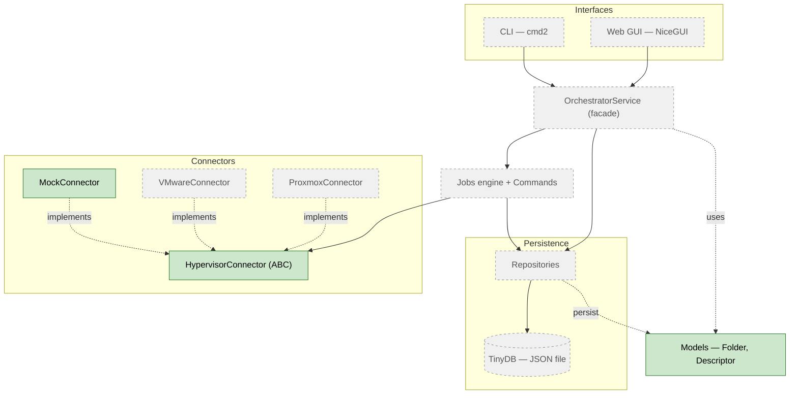
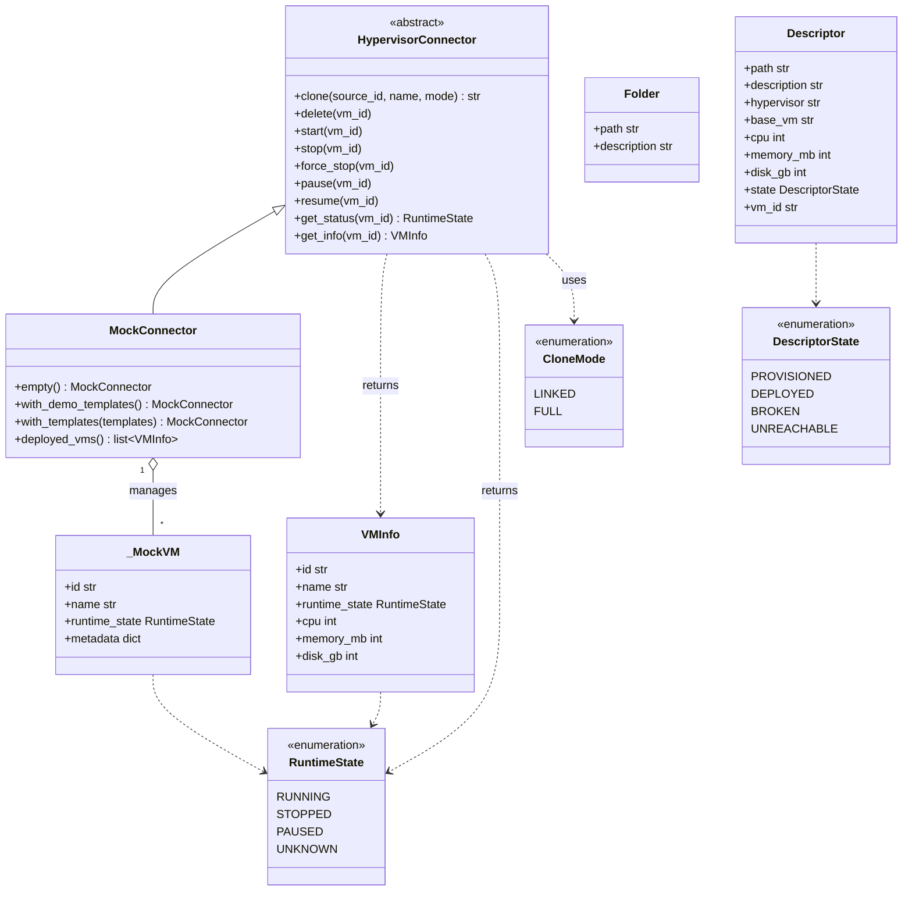

# UnivOrch — Internal diagrams

> **As-built view.** These diagrams reflect the **current code** and grow with it,
> updated roughly once a day. For the intended end-state design see
> [architecture.md](architecture.md); this document shows what actually exists.
>
> **Last updated:** 2026-05-24 — Sprint 1, connector contract + MockConnector + domain models.

**Legend:** solid = implemented · dashed/grey = designed, not yet implemented.

---

## 1. Component architecture

How the pieces fit together. Most of the engine is still pending; the connector
subsystem and the domain models are the first implemented parts.

---

## 2. Class diagram (implemented code)

The classes that exist today, in `connectors/` and `models.py`. Fields typed
`X | None` (`description`, `cpu`, `memory_mb`, `disk_gb`, `vm_id`) are optional
and default to `None`.

---

## How to view

GitHub renders Mermaid automatically — open this file in the repository. In
VSCode, the *Markdown Preview Mermaid Support* extension renders it in the
preview pane. For the final thesis, export to PNG/SVG/PDF with `mermaid-cli` or a
screenshot of the rendered diagram.
