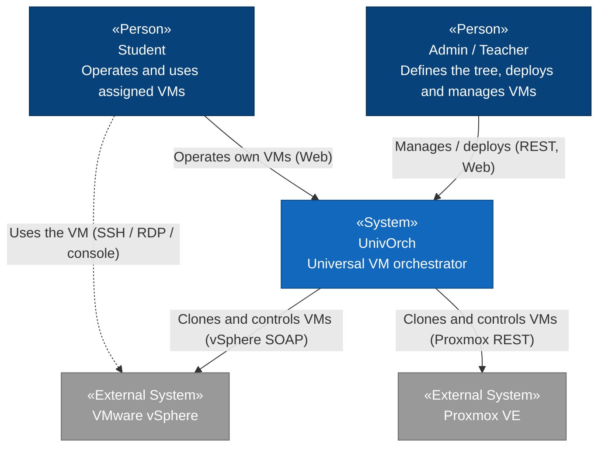
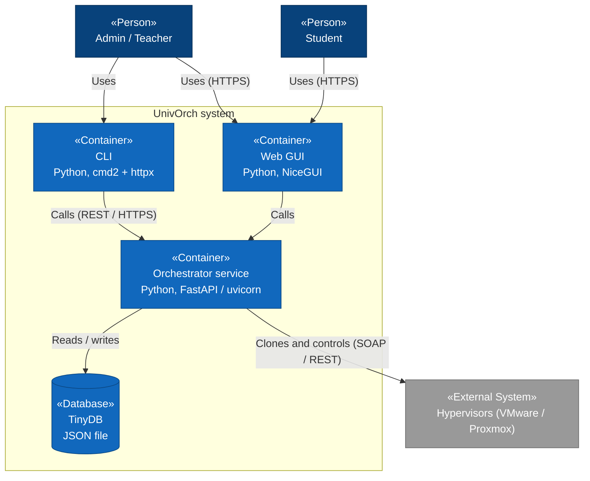
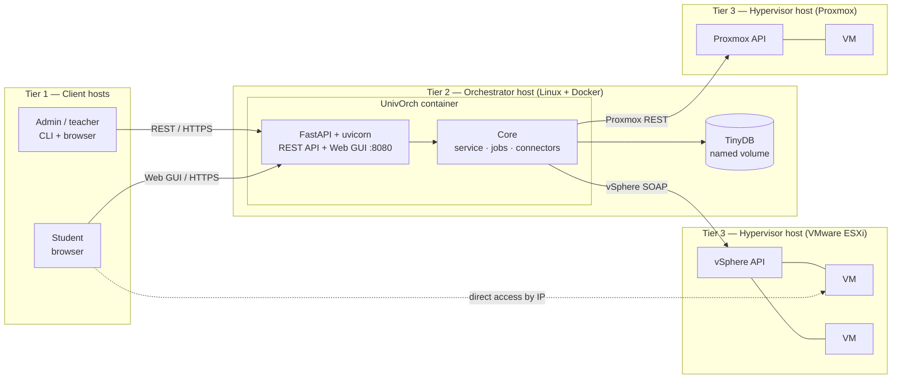
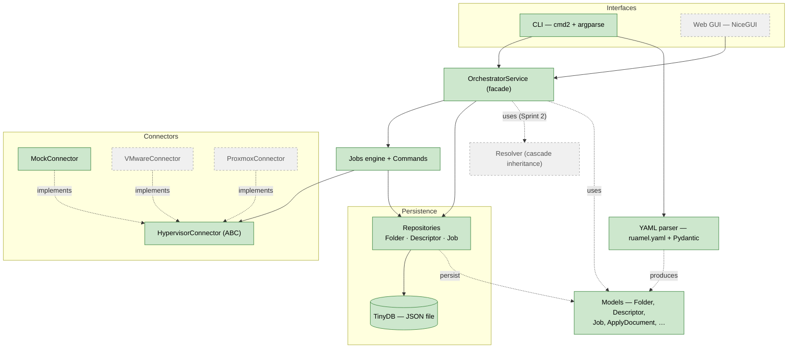
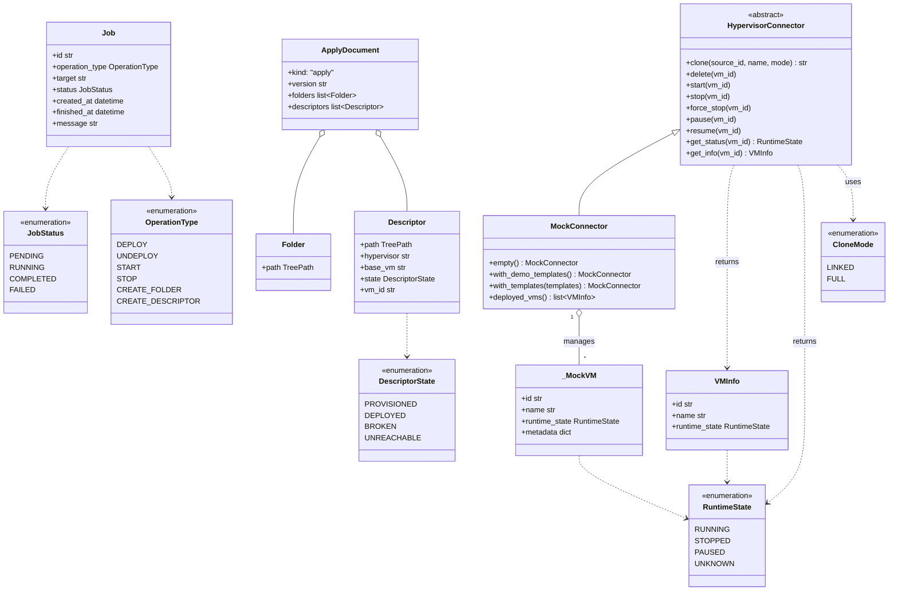
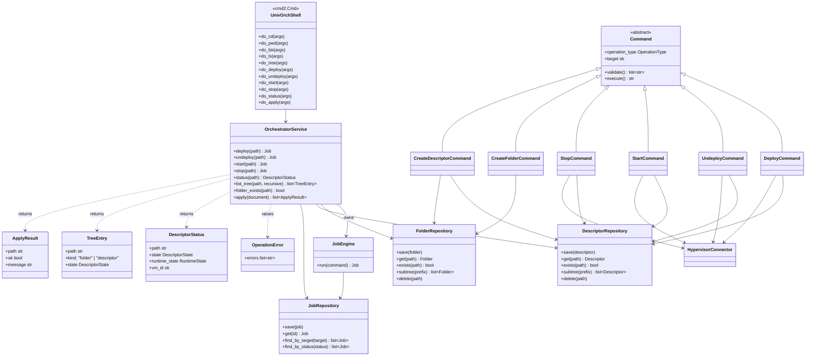

# UnivOrch — Internal diagrams

> This document follows the **C4 model** (Context → Container → Component → Code,
> plus a supplementary **Deployment** view). The higher levels (Context,
> Container, Deployment) are the intended design; the lower levels (Component,
> Code) are **as-built** and grow with the code. For the full narrative design see
> [architecture.md](architecture.md).
>
> **Terminology note:** a C4 *container* is any independently runnable unit (a
> service, a database, the CLI) — **not** a Docker container. UnivOrch's service
> happens to run in a Docker container, but the word means different things.
>
> **Rendering note:** the diagrams follow the C4 *model*; for reliable layout
> they are drawn as Mermaid flowcharts and class diagrams (with C4 stereotypes
> like «Person» and «Container»), not Mermaid's experimental native C4 renderer.
>
> **Last updated:** 2026-05-26 — Sprint 1 closed: connectors, persistence, Jobs
> engine + Commands, `OrchestratorService` facade, YAML parser, and cmd2-based
> CLI with argparse help. Web GUI and real hypervisor connectors still pending.

---

## 1. Context (C4 level 1)

The big picture: who uses UnivOrch and which external systems it talks to.

---

## 2. Containers (C4 level 2)

The independently runnable units that make up UnivOrch.

---

## 3. Deployment (C4 supplementary view)

How the containers map onto hosts and tiers. This is the **target** topology —
largely future; it shows how the pieces are meant to be deployed.

- **Tier 1 — clients:** admins/teachers (CLI + browser) and students (browser).
- **Tier 2 — orchestrator:** one Linux host running UnivOrch in a Docker
  container; TinyDB persists on a host-managed named volume mounted into it.
- **Tier 3 — hypervisors + VMs:** VMware/Proxmox hosts running the VMs; the
  connectors talk to each hypervisor's management API.

In **development and the demo**, the `MockConnector` stands in for the hypervisor
tier: no real ESXi/Proxmox hosts are needed, and the orchestrator runs directly
with `uv run` (no container).

---

## 4. Components (C4 level 3) — as-built

Modules inside the orchestrator. After Sprint 1, the engine, persistence and the
CLI are in place; the web GUI and the real hypervisor connectors are still pending.

**Legend:** solid green = implemented · dashed/grey = designed, not yet implemented.

---

## 5. Code (C4 level 4) — as-built

The classes that exist after Sprint 1. Optional fields (typed `X | None`,
default `None`) are omitted from the diagrams to keep them readable. Two views,
because one diagram with everything is unreadable: **5.1 Domain + Connectors**
and **5.2 Engine, Persistence, Service, CLI**.

### 5.1 Domain models & connectors

### 5.2 Engine, persistence, service & CLI

---

## How to view

GitHub renders Mermaid automatically — open this file in the repository. In
VSCode, the *Markdown Preview Mermaid Support* extension renders it in the
preview pane. For the final thesis, export to PNG/SVG/PDF with `mermaid-cli` or a
screenshot of the rendered diagram.
