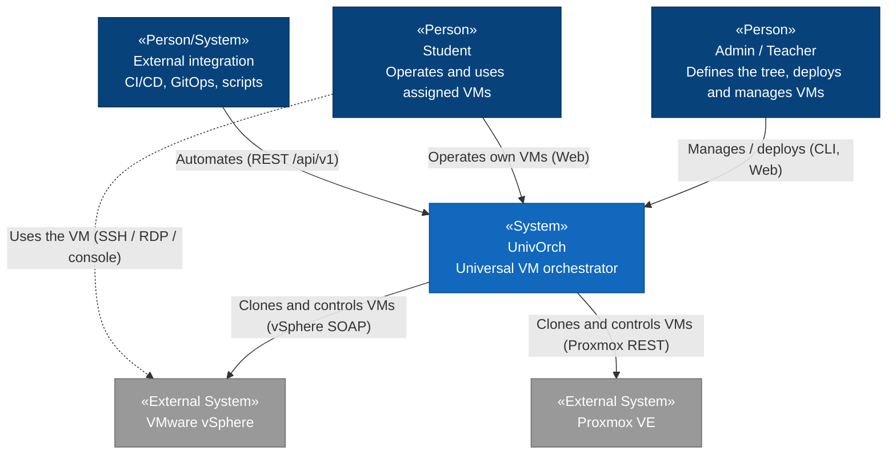
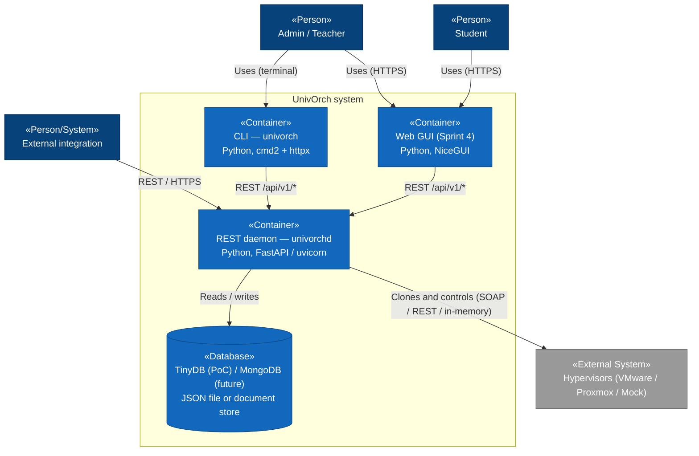
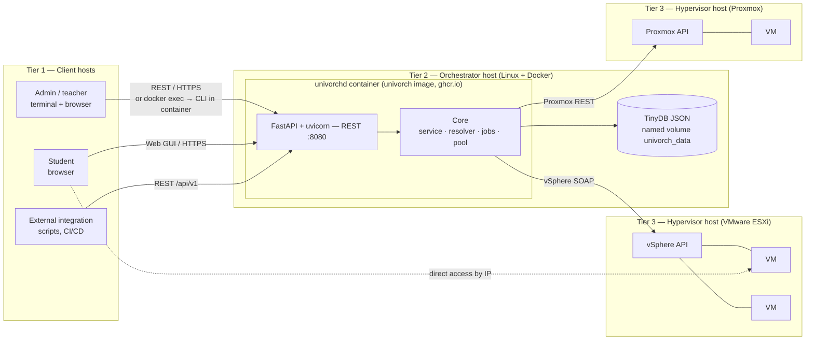
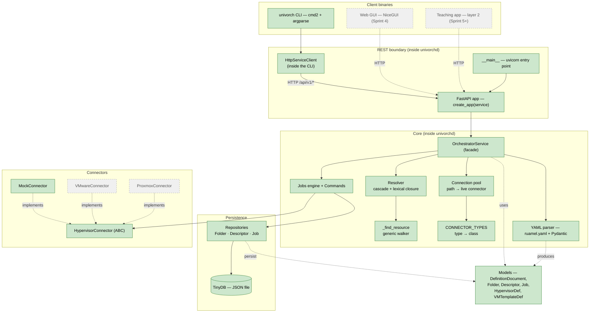
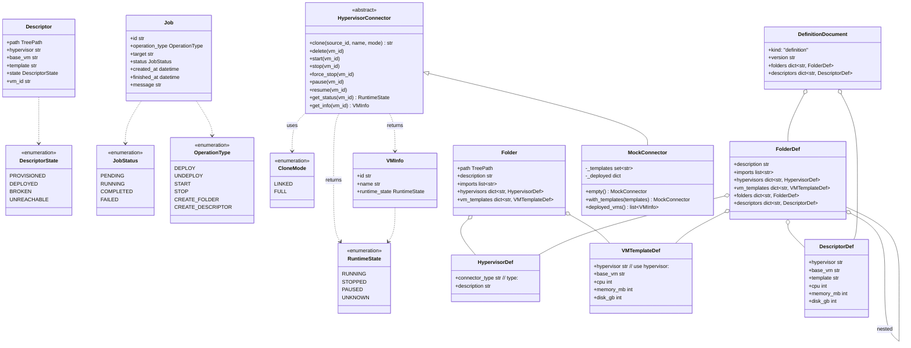

# UnivOrch — Internal diagrams

> This document follows the **C4 model** (Context → Container → Component → Code,
> plus a supplementary **Deployment** view). The higher levels (Context,
> Container, Deployment) are the intended design; the lower levels (Component,
> Code) are **as-built** and grow with the code. For the full narrative design see
> [architecture.md](architecture.md).
>
> **Terminology note:** a C4 *container* is any independently runnable unit (a
> service, a database, the CLI) — **not** a Docker container. UnivOrch's daemon
> happens to run in a Docker container, but the word means different things.
>
> **Rendering note:** the diagrams follow the C4 *model*; for reliable layout
> they are drawn as Mermaid flowcharts and class diagrams (with C4 stereotypes
> like «Person» and «Container»), not Mermaid's experimental native C4 renderer.
>
> **Last updated:** 2026-06-07 — Sprint 3 closed. The daemon (`univorchd`) and
> the CLI client (`univorch`) are now two distinct binaries; everything goes
> through the REST API. The Resolver, connector type registry and live-session
> pool are in place. Real hypervisor connectors and the web GUI are still
> pending.

---

## 1. Context (C4 level 1)

The big picture: who uses UnivOrch and which external systems it talks to.

---

## 2. Containers (C4 level 2)

The independently runnable units that make up UnivOrch. **Note**: the daemon
(`univorchd`) and the CLI (`univorch`) are now two separate binaries, both
published as entry points of the same Python package. Every client speaks
HTTP to the daemon; nothing embeds the orchestrator in-process anymore.

---

## 3. Deployment (C4 supplementary view)

How the containers map onto hosts and tiers. This is the **real** topology
since Sprint 3: a single Linux host running the daemon in a Docker container,
with the CLI either driven from the same container (via `docker exec`) or
from any external host that can reach the REST port.

- **Tier 1 — clients:** admins/teachers (CLI or browser) and students (browser).
- **Tier 2 — orchestrator host:** one Linux machine running Docker. The
  `univorchd` daemon lives in a container; the TinyDB JSON file persists on a
  named volume.
- **Tier 3 — hypervisor hosts + VMs:** VMware and Proxmox hosts running the
  VMs the orchestrator clones and controls.

In the **mock-driven demo**, the `MockConnector` replaces both hypervisor
tiers: the daemon runs the same Docker image, only the connector type
declared by the tree changes.

---

## 4. Components (C4 level 3) — as-built

Modules inside the daemon. After Sprint 3 the daemon (`univorchd`),
the CLI (`univorch`), the Resolver, the connector type registry and the
live-session pool are all in place. The web GUI and the real hypervisor
connectors are still pending.

**Legend:** solid green = implemented · dashed/grey = designed, not yet implemented.

---

## 5. Code (C4 level 4) — as-built

The classes that exist after Sprint 3. Optional fields (typed `X | None`,
default `None`) are omitted from the diagrams to keep them readable. Two
views, because one diagram with everything is unreadable: **5.1 Domain +
Connectors** and **5.2 Engine, Service, REST boundary**.

### 5.1 Domain models & connectors

### 5.2 Engine, service & REST boundary

```mermaid
classDiagram
    class Command {
        <<abstract>>
        +operation_type OperationType
        +target str
        +validate() list~str~
        +execute() str
    }
    class DeployCommand
    class UndeployCommand
    class StartCommand
    class StopCommand
    class CreateFolderCommand
    class CreateDescriptorCommand

    class JobEngine {
        +run(command) Job
    }

    class FolderRepository {
        +save(folder)
        +get(path) Folder
        +exists(path) bool
        +subtree(prefix) list~Folder~
        +delete(path)
    }
    class DescriptorRepository {
        +save(descriptor)
        +get(path) Descriptor
        +exists(path) bool
        +subtree(prefix) list~Descriptor~
        +delete(path)
    }
    class JobRepository {
        +save(job)
        +get(id) Job
        +find_by_target(target) list~Job~
        +find_by_status(status) list~Job~
    }

    class OrchestratorAPI {
        <<Protocol>>
        +deploy(path) Job
        +undeploy(path) Job
        +start(path) Job
        +stop(path) Job
        +status(path) DescriptorStatus
        +list_tree(path, recursive) list~TreeEntry~
        +folder_exists(path) bool
        +inspect(path, resolved) Descriptor or Folder
        +load(document, destination) list~LoadResult~
    }
    class OrchestratorService {
        -_connector_types dict
        -_connection_pool dict
        +deploy(path) Job
        +undeploy(path) Job
        +start(path) Job
        +stop(path) Job
        +status(path) DescriptorStatus
        +list_tree(path, recursive) list~TreeEntry~
        +folder_exists(path) bool
        +inspect(path, resolved) Descriptor or Folder
        +load(document, destination) list~LoadResult~
        -_resolve_hypervisor(original, resolved, origin) HypervisorConnector
    }
    class HttpServiceClient {
        -_http httpx.Client
        +deploy(path) Job
        +undeploy(path) Job
        +start(path) Job
        +stop(path) Job
        +status(path) DescriptorStatus
        +list_tree(path, recursive) list~TreeEntry~
        +folder_exists(path) bool
        +inspect(path, resolved) Descriptor or Folder
        +load(document, destination) list~LoadResult~
        -_send(method, url, ...) Response
    }
    class OperationError {
        +errors list~str~
    }
    class DescriptorStatus {
        +path str
        +state DescriptorState
        +runtime_state RuntimeState
        +vm_id str
    }
    class TreeEntry {
        +path str
        +kind: "folder" | "descriptor"
        +state DescriptorState
    }
    class LoadResult {
        +path str
        +ok bool
        +message str
    }
    class InspectResult {
        +kind: "folder" | "descriptor"
        +folder Folder
        +descriptor Descriptor
    }

    class create_app {
        <<function>>
        +create_app(service) FastAPI
    }
    class univorchd {
        <<entry point>>
        +main()
    }

    class UnivOrchShell {
        <<cmd2.Cmd>>
        -_service OrchestratorAPI
        -_remote str
        +do_cd(args)
        +do_pwd(args)
        +do_list(args)
        +do_tree(args)
        +do_inspect(args)
        +do_deploy(args)
        +do_undeploy(args)
        +do_start(args)
        +do_stop(args)
        +do_status(args)
        +do_load(args)
        +do_connect(args)
    }

    Command <|-- DeployCommand
    Command <|-- UndeployCommand
    Command <|-- StartCommand
    Command <|-- StopCommand
    Command <|-- CreateFolderCommand
    Command <|-- CreateDescriptorCommand

    OrchestratorService ..|> OrchestratorAPI : implements (structural)
    HttpServiceClient ..|> OrchestratorAPI : implements (structural)

    OrchestratorService --> JobEngine : owns
    OrchestratorService --> FolderRepository
    OrchestratorService --> DescriptorRepository
    OrchestratorService --> JobRepository
    OrchestratorService ..> OperationError : raises
    OrchestratorService ..> DescriptorStatus : returns
    OrchestratorService ..> TreeEntry : returns
    OrchestratorService ..> LoadResult : returns
    OrchestratorService ..> HypervisorConnector : pool of

    JobEngine --> JobRepository
    DeployCommand --> DescriptorRepository
    DeployCommand --> HypervisorConnector
    UndeployCommand --> DescriptorRepository
    UndeployCommand --> HypervisorConnector
    StartCommand --> DescriptorRepository
    StartCommand --> HypervisorConnector
    StopCommand --> DescriptorRepository
    StopCommand --> HypervisorConnector
    CreateFolderCommand --> FolderRepository
    CreateDescriptorCommand --> DescriptorRepository
    CreateDescriptorCommand --> FolderRepository

    create_app --> OrchestratorService : injects
    create_app ..> InspectResult : wraps inspect
    univorchd --> create_app
    univorchd ..> OrchestratorService : composes

    HttpServiceClient ..> OperationError : raises on 400 or ConnectError
    UnivOrchShell --> OrchestratorAPI
    UnivOrchShell ..> HttpServiceClient : default backend
```

---

## How to view

GitHub renders Mermaid automatically — open this file in the repository. In
VSCode, the *Markdown Preview Mermaid Support* extension renders it in the
preview pane. The thesis embeds these diagrams as PDF figures generated from
the Mermaid sources with `mermaid-cli` (`mmdc`); see
`docs/memoria/figures/mermaid/` and the CI workflow for the build pipeline.
