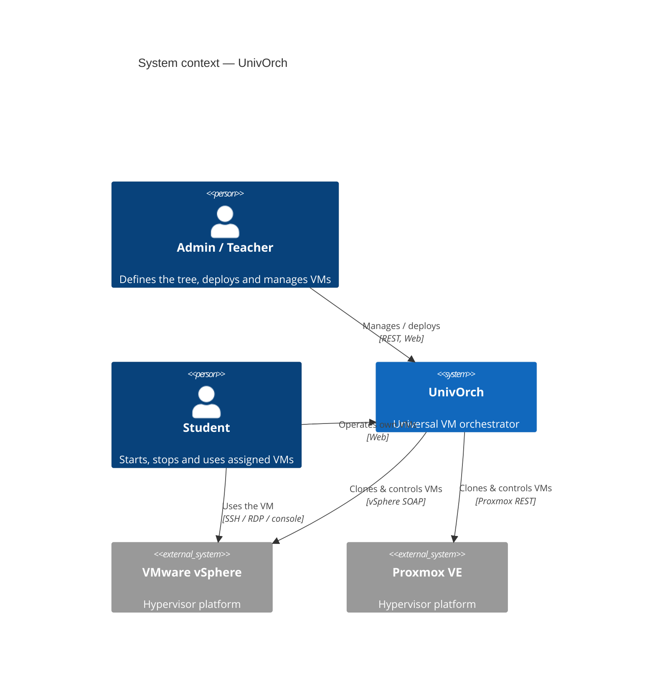
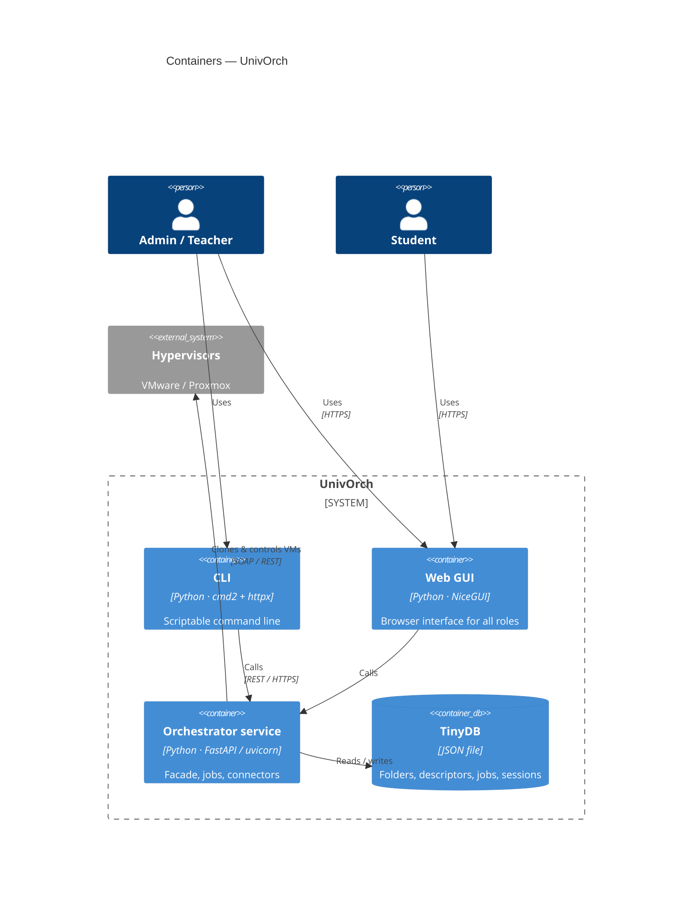
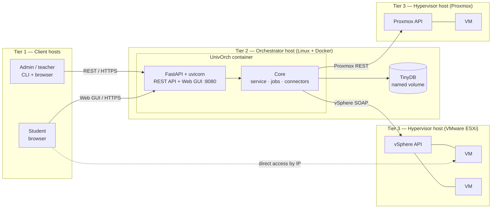
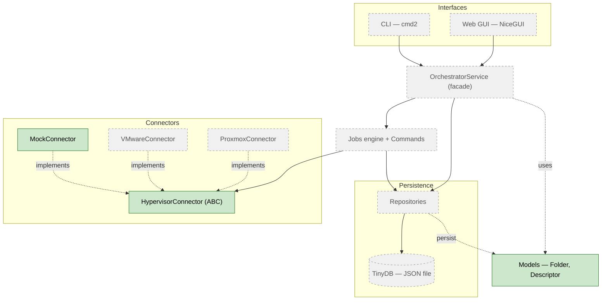
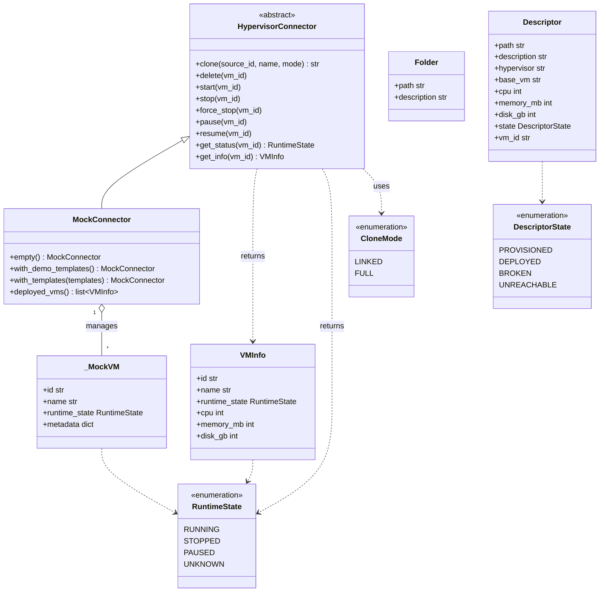

# UnivOrch — Internal diagrams

> This document follows the **C4 model** (Context → Container → Component → Code,
> plus a supplementary **Deployment** view). The higher levels (Context,
> Container, Deployment) are the intended design; the lower levels (Component,
> Code) are **as-built** and grow with the code. For the full narrative design see
> [architecture.md](architecture.md).
>
> **Terminology note:** a C4 *container* is any independently runnable unit (a
> service, a database, the CLI) — **not** a Docker container. UnivOrch's service
> happens to run in a Docker container, but the word means different things.
>
> **Mermaid note:** Context and Container use Mermaid's native C4 renderer, which
> is experimental; if they render poorly they can be redrawn as plain flowcharts.
>
> **Last updated:** 2026-05-24 — Sprint 1, connector contract + MockConnector + domain models.

---

## 1. Context (C4 level 1)

The big picture: who uses UnivOrch and which external systems it talks to.

---

## 2. Containers (C4 level 2)

The independently runnable units that make up UnivOrch.

---

## 3. Deployment (C4 supplementary view)

How the containers map onto hosts and tiers. This is the **target** topology —
largely future; it shows how the pieces are meant to be deployed.

- **Tier 1 — clients:** admins/teachers (CLI + browser) and students (browser).
- **Tier 2 — orchestrator:** one Linux host running UnivOrch in a Docker
  container; TinyDB persists on a host-managed named volume mounted into it.
- **Tier 3 — hypervisors + VMs:** VMware/Proxmox hosts running the VMs; the
  connectors talk to each hypervisor's management API.

In **development and the demo**, the `MockConnector` stands in for the hypervisor
tier: no real ESXi/Proxmox hosts are needed, and the orchestrator runs directly
with `uv run` (no container).

---

## 4. Components (C4 level 3) — as-built

Modules inside the orchestrator. Most of the engine is still pending; the
connector subsystem and the domain models are the first implemented parts.

**Legend:** solid = implemented · dashed/grey = designed, not yet implemented.

---

## 5. Code (C4 level 4) — as-built

The classes that exist today, in `connectors/` and `models.py`. Fields typed
`X | None` (`description`, `cpu`, `memory_mb`, `disk_gb`, `vm_id`) are optional
and default to `None`.

---

## How to view

GitHub renders Mermaid automatically — open this file in the repository. In
VSCode, the *Markdown Preview Mermaid Support* extension renders it in the
preview pane. For the final thesis, export to PNG/SVG/PDF with `mermaid-cli` or a
screenshot of the rendered diagram.
