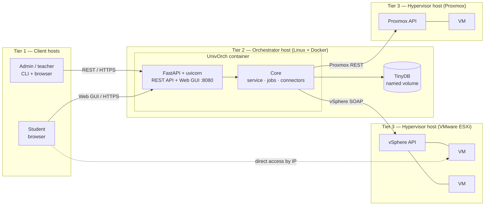
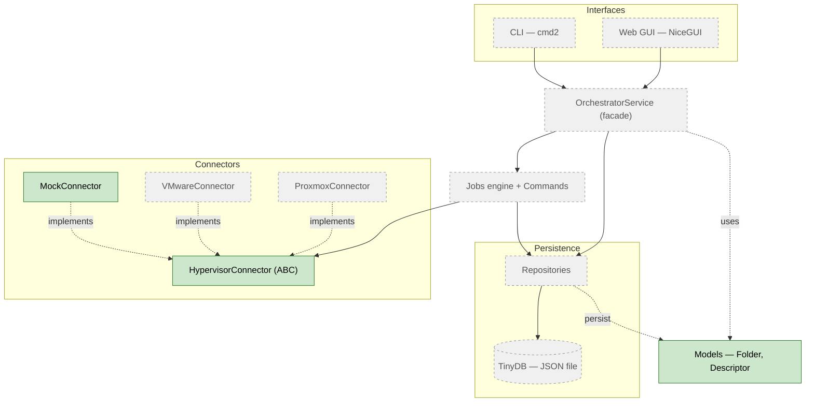
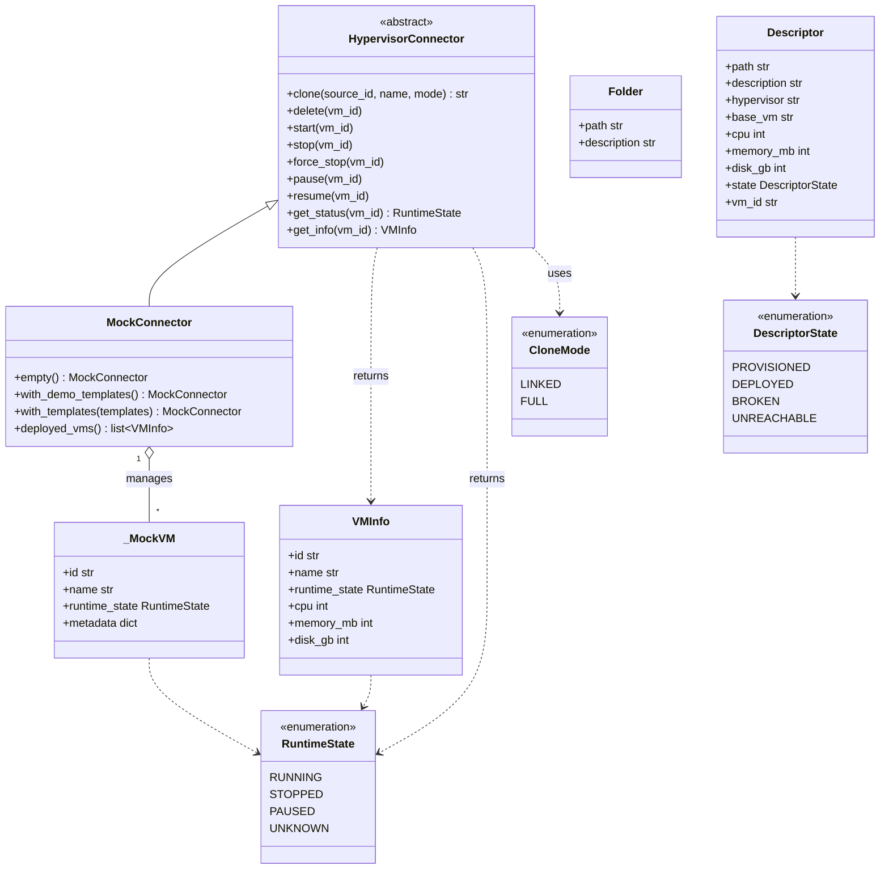

# UnivOrch — Internal diagrams

> This document collects the project's diagrams: the intended **deployment
> topology** (the general philosophy) and **as-built** views of the code, which
> grow with it and are updated roughly once a day. For the full intended design
> see [architecture.md](architecture.md).
>
> **Last updated:** 2026-05-24 — Sprint 1, connector contract + MockConnector + domain models.

---

## 1. Deployment topology

The general philosophy across hosts and tiers. This is the **target** scenario,
largely future — it shows how the pieces are meant to be deployed, not what is
built yet.

- **Tier 1 — clients:** admins/teachers (CLI + browser) and students (browser).
- **Tier 2 — orchestrator:** a single Linux host running UnivOrch in a Docker
  container; TinyDB persists on a host-managed named volume mounted into it.
- **Tier 3 — hypervisors + VMs:** VMware/Proxmox hosts running the VMs. The
  orchestrator's connectors talk to each hypervisor's management API.

In **development and the demo**, the `MockConnector` stands in for the hypervisor
tier: no real ESXi/Proxmox hosts are needed, and the orchestrator runs directly
with `uv run` (no container).

---

## 2. Component architecture

How the pieces fit together inside the orchestrator. Most of the engine is still
pending; the connector subsystem and the domain models are the first implemented
parts.

**Legend:** solid = implemented · dashed/grey = designed, not yet implemented.

---

## 3. Class diagram (implemented code)

The classes that exist today, in `connectors/` and `models.py`. Fields typed
`X | None` (`description`, `cpu`, `memory_mb`, `disk_gb`, `vm_id`) are optional
and default to `None`.

---

## How to view

GitHub renders Mermaid automatically — open this file in the repository. In
VSCode, the *Markdown Preview Mermaid Support* extension renders it in the
preview pane. For the final thesis, export to PNG/SVG/PDF with `mermaid-cli` or a
screenshot of the rendered diagram.
