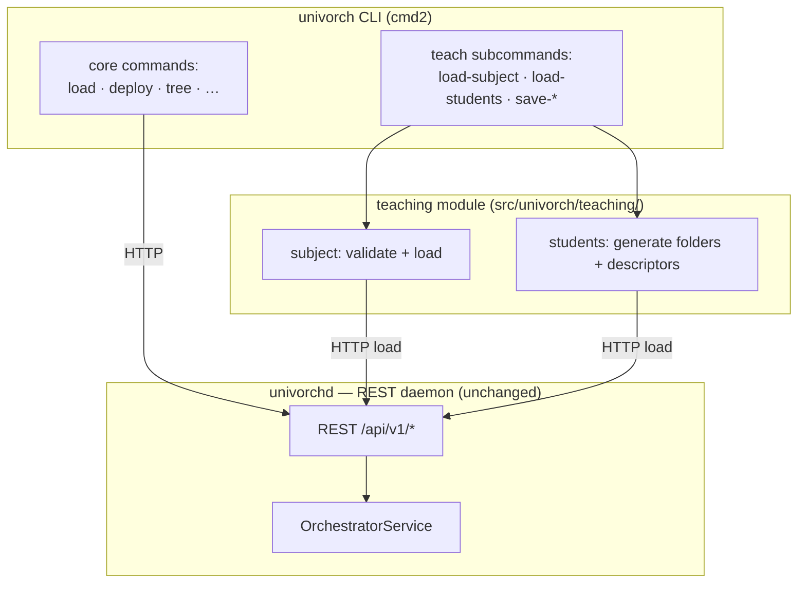

# Teaching Application — Architecture

> Phase 3 deliverable: Architecture Design (layer-2 teaching application)
> How the teaching application is built. Sources: `docs/teaching/vision.md`,
> `docs/teaching/requirements.md`, core `docs/architecture.md`.

This document describes the design of the teaching application: where its
code lives, how it talks to the core, the shape of its data, and the
design decisions behind it (DEC-037 onwards in `claude/decisiones.md`).

The teaching application reuses the core's technology stack (Phase 4) and
development environment (Phase 5) without change; those phases are not
repeated here. Only what is specific to the teaching layer is documented.

---

## 1. Position in the Two-Layer Architecture

The teaching application is the layer-2 application of the two-layer
architecture (core DEC-004). It is a **client** of the orchestrator,
not a part of it.



The teaching commands live next to the core commands in the same CLI.
The teaching module does the teaching-specific work (validation, folder
and descriptor generation) and then calls the core through the same HTTP
client the CLI already uses. The daemon is unchanged: it has no knowledge
of subjects, desktops or students.

---

## 2. Code Structure

The teaching code is a module inside the existing package:

```
src/univorch/
├── teaching/
│   ├── __init__.py
│   ├── models.py       # SubjectDef, StudentList (Pydantic)
│   ├── subject.py      # validation + load of a subject
│   └── students.py     # student-list parsing + folder/descriptor generation
└── interfaces/cli/
    └── app.py          # adds the `teach` subcommand group
```

- `teaching/models.py` holds the Pydantic models specific to the
  teaching layer: the subject document (the marked folder with its
  desktop) and the student list.
- `teaching/subject.py` validates a subject document against the rules of
  requirements 4.1 and turns it into a core `load`.
- `teaching/students.py` parses a student list, validates it, and
  generates the per-student folders and descriptors as a core definition
  document.
- The CLI gains a `do_teach` command with argparse subparsers for the
  four operations. No separate entry point, no separate process.

---

## 3. Communication with the Core

The teaching module is a pure client of the core's REST API. It builds
core definition documents and submits them through the same
`HttpServiceClient` the CLI uses (core Sprint 3.2). It never touches the
repositories, the resolver or the job engine directly.

Two consequences:

- The teaching layer benefits automatically from the core's validation.
  When it submits the generated descriptors with `use template: <name>`,
  the core resolver validates the references and rejects the load if a
  template is not resolvable — the same fail-fast behaviour as any load
  (core DEC-027). The teaching layer does not re-implement reference
  resolution.
- The teaching layer could be moved out of the CLI (into a web page, a
  separate service) without changing how it talks to the core. The seam
  is the REST API.

---

## 4. Data Model

### 4.1 Subject

A subject is an ordinary core folder with two teaching-specific fields:

| Field | Type | Meaning | Who reads it |
|---|---|---|---|
| `kind` | `"subject"` | Marks the folder as a subject | Teaching layer |
| `desktop` | list of names | The templates that make a student's set of machines | Teaching layer |

Both fields are stored by the core as opaque metadata on the folder. The
core does not interpret them; only the teaching layer does. This keeps
the core domain-agnostic (core DEC-004).

A subject also carries ordinary core content: `define templates:` and/or
`import:` providing the templates the desktop refers to.

Example:

```yaml
redes-2026/:
  kind: subject
  import: [linux-base-vm]
  define templates:
    workstation: { use template: linux-base-vm, cpu: 2 }
    servidor:    { use template: linux-base-vm, cpu: 4 }
  desktop: [workstation, servidor]
```

### 4.2 Student list

A standalone document, not part of the tree:

```yaml
kind: student-list
version: "1"
students:
  - alumno01
  - alumno02
```

For the proof of concept it is a list of usernames. Identity data (email,
full name) belongs to the user registry (core DEC-021) and is out of
scope here.

### 4.3 Generated student structure

From the subject above and the list above, the teaching layer generates,
under `redes-2026/`:

```
redes-2026/alumno01/workstation   →  use template: workstation
redes-2026/alumno01/servidor      →  use template: servidor
redes-2026/alumno02/workstation   →  use template: workstation
redes-2026/alumno02/servidor      →  use template: servidor
```

Each descriptor is named after a desktop template and carries
`use template: <name>`. The core resolves the reference against the
subject's definitions; the resolver finds `workstation` and `servidor`
in the subject folder and merges them in. There is no new `use desktop:`
keyword: because the teaching layer creates the descriptors, it writes
`use template: <name>` directly, which the core already understands.

---

## 5. The Four Operations

### 5.1 `teach load-subject <file> [destination]`

1. Parse the file as a subject document.
2. Validate (requirements 4.1): `kind: subject`, non-empty `desktop`,
   every desktop name resolvable, no child folders, no duplicate list
   entries.
3. If valid, submit it to the core `load` at the destination.
4. On any validation failure, report the list of problems and load
   nothing.

Same syntax and destination semantics as the core `load`; the only
addition is the validation step.

### 5.2 `teach save-subject <path>`

1. Read the subject folder from the tree (its local definition:
   templates, desktop, `kind`).
2. Serialize it to a portable YAML, without students and without runtime
   state.
3. The output is a valid input to `load-subject`.

This is the inverse of `load-subject` and the mechanism for reusing a
subject across terms.

### 5.3 `teach load-students <subject-path> <file>`

1. Check that `subject-path` is a folder with `kind: subject`.
2. Parse and validate the student list (no duplicates).
3. Read the subject's `desktop`.
4. Build a core definition document with one folder per student and one
   descriptor per desktop template inside each.
5. Submit it to the core `load` at the subject path.

Add-only: students already present are no-ops; no student is removed
(withdrawal is out of scope).

### 5.4 `teach save-students <subject-path>`

1. Read the student folders directly under the subject.
2. Write their names to a YAML in the student-list format.

The inverse of `load-students` at the list level.

---

## 6. Validation Strategy

Validation is split the same way as in the core (core DEC-026/027):

- **Syntactic validation** (is this a well-formed subject / student-list
  document?) happens in the teaching layer's Pydantic models.
- **Teaching-level validation** (is the desktop non-empty? are the
  desktop names resolvable? no child folders? no duplicates?) happens in
  `teaching/subject.py` before any core call.
- **Core validation** (do the references resolve? does the parent
  exist?) happens in the core when the generated document is loaded,
  reusing the core resolver. The teaching layer does not duplicate it.

A subject that passes teaching validation but somehow produces an
unresolvable descriptor is still caught by the core at load time. The two
layers of validation are complementary, not redundant.

---

## 7. What the Teaching Layer Does Not Do

- It does not deploy machines. Generated descriptors are `provisioned`;
  deploying them is a core operation.
- It does not remove students. Withdrawal needs confirmation and a
  deployed-machine check, deferred as future work.
- It does not manage user identity. Usernames are taken as given.
- It does not run as a service. It is CLI subcommands over the existing
  daemon.

---

## 8. Future Directions

- **Deploy-subject:** a `teach deploy-subject` that batch-deploys every
  provisioned machine of a subject, using the core's batch job model.
- **Withdrawal:** a withdrawal-aware `load-students` that detects
  students no longer on the list, warns the professor, checks for
  deployed machines and removes the folder on confirmation.
- **Web interface:** the same teaching operations exposed as NiceGUI
  pages inside the daemon, calling the same logic. No architectural
  change: the teaching module is already a thin client of the service.
- **Multiple desktops:** a subject with more than one desktop, the
  professor choosing which desktop a given group of students gets.
- **User registry integration:** validating and creating usernames
  against the core's user registry when authentication lands.

---

## 9. Design Decision Index

| DEC | Topic |
|---|---|
| DEC-037 | Teaching application as a CLI subcommand client |
| DEC-038 | Subject and desktop as opaque tree metadata |
| DEC-039 | Student folder generation and add-only semantics |
